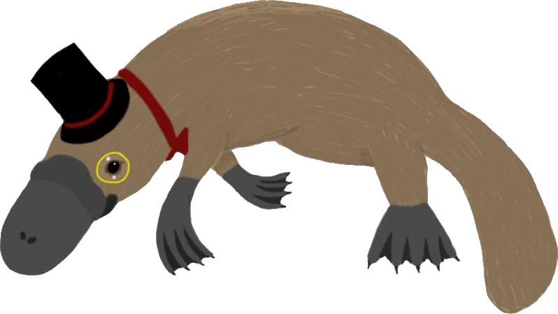

.. Platipy documentation master file, created by
   sphinx-quickstart on Wed Aug 29 15:35:26 2012.
   You can adapt this file completely to your liking, but it should at least
   contain the root `toctree` directive.
   
.. highlight:: python
   :linenothreshold: 5

###############
Platipy Project
###############

The platipy project is an effort to document efforts to build a game in Python and spyral for the OLPC XO. Read the introduction if you're interested in the motivation and some details behind choices made, or skip right to the guide if you're ready to start programming.

.. toctree::
    :maxdepth: 1
    
    news

Building Games
--------------
.. toctree::
   :maxdepth: 2
   
   intro
   tutorials
   
Spyral Documentation
--------------------
.. toctree::
   :maxdepth: 2
   
   spyral_docs
   ref
   cheats
   
Further References
------------------
.. toctree::
   :maxdepth: 2
   
   gamedev
   educgamedesign
   
The Platipy Project
-------------------
.. toctree::
    :maxdepth: 2
    
    contributor_application
    gallery
    openproblems

Release Information
-------------------
.. toctree::
   :maxdepth: 2
   
   release_info
