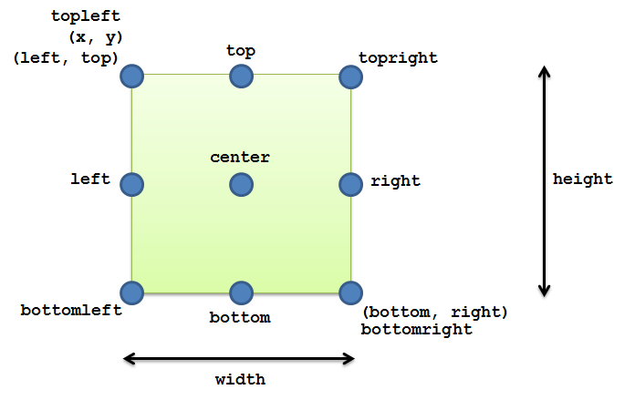

*********************
Spyral API Appendices
*********************

.. topic:: Appendices

    .. toctree::
        :glob:
        :maxdepth: 2
        
        refs/events

.. _ref.anchors:

Anchors
-------

There are several anchor points available, each given by a different string. The image below shows their locations on an image.

.. image:: images/anchors.png

.. _ref.keys:

Keyboard Keys
-------------

.. _ref.mods:

Keyboard Modifiers
------------------

.. _ref.layering:

Layering
--------

Rects
-----

:class:`Rects <spyral.Rect>` can be accessed in a number of ways. The diagram below demonstrates the possibel properties.

Styleable properties
--------------------

.. _ref.image_formats:

Valid Image Formats
-------------------

* JPG
* PNG
* GIF (non animated)
* BMP
* PCX
* TGA (uncompressed)
* TIF
* LBM (and PBM)
* PBM (and PGM, PPM)
* XPM
