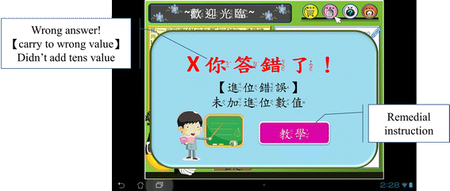

Digital Math Activity: Diagnostic Feedback
------------------------------------------

**Title**: "Embedding diagnostic mechanisms in a digital game for learning mathematics" :cite:`2014:huang`

**Summary**: 

This is a study where they made a multiple-choice activity with diagnostic feedback, and then did an assessment. The `ARCS model <http://www.learning-theories.com/kellers-arcs-model-of-motivational-design.html>`_ , which is pretty helpful from a design point of view:

* Gain the student's **attention**
* Establish **relevance**
* Increase student's **confidence**
* Give the student **satisfaction**

As I previously said, this is not a game: it's a multiple-choice activity. It isn't meant to *teach*, it's meant to be a low-stakes assessment with **diagnostic feedback**. They put some good work into identifying the mistakes that a student could make when doing addition ("diagnostics"). When they choose the wrong answer, they give feedback targeted to that student. Think of it like really good compiler errors - it can make or break your understanding of the error when you're just starting out! This is 

They assessed 56 2nd graders (45% female) (Southern Taiwan). One group had the diagnostic element, the other was basically just answering multiple choice questions. Their results for their measures:

* **Learning achievement questions from accredited textbooks** : students given the diagnostic feedback performed better than the students who didn't, both in comprehension and application type of questions.
* **Mathematical anxiety** : diagnostic feedback students were a little less anxious
* **Learning motivation based on ARCS** : Feedback was positive, except some learners felt that the material was too simple.
* **Qualitative interviews** : Results confirm ARCS data

**Weaknesses** :

* Relatively small sample size.
* Although this activity is more fun than a quiz, it is still not as much fun as a regular game - multiple-choice is a pretty boring
* Only intended for assessment rather than actual learning.

Formal Abstract
^^^^^^^^^^^^^^^

Mathematics is closely related to daily life, but it is also one of the lessons which often cause anxiety to primary school students. Digital game-based learning (DGBL) has been regarded as a sound learning strategy in raising learner willingness and interest in many disciplines. Thus, ways of designing a DGBL system to mitigate anxiety are well worth studying. This study adopts an Input–Process–Outcome DGBL model to develop a DGBL system with a diagnostic mechanism strategy for a primary school mathematics course. In addition to exploring the impact of different learning methods on learning performance, this study further analyzes the learning methods in terms of learner anxiety about mathematics, learning motivation and learning satisfaction from the perspective of Attention, Relevance, Confidence-building, and Satisfaction (ARCS) motivation theory. The diagnostic mechanism strategy demonstrates the advantages of the DGBL system for mathematics learning. During the learning process, the ARCS questionnaire revealed that students who engage in learning through the DGBL method are positively motivated. The findings of this study suggest that centering on the daily life experiences of learners, integrating a proper game model into mathematics learning and providing a diagnostic mechanism prompt can effectively enhance interest in learning mathematics and reduce anxiety. When anxiety is mitigated, both learning motivation and learning performance are enhanced.

References
^^^^^^^^^^

.. bibliography:: refs.bib